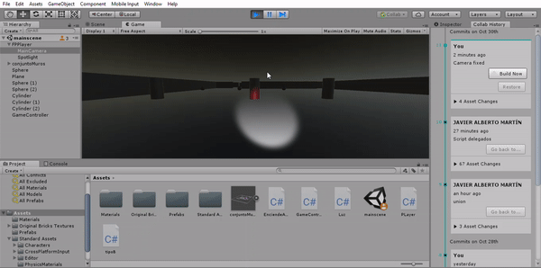
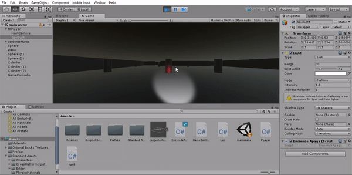

# InformeDelegados
## Tarea a realizar: 
Crear un escenario básico para la escena del proyecto para la evaluación final.
Agregar dos tipos de GameObject de los que haya varias instancias en la escena.
Implementar un controlador de escena usando el patrón delegado que gestione las siguientes acciones:
Si el jugador choca con un objeto de tipo A se incrementa su poder.
Si el jugador choca con objetos de tipo B, todos los de ese tipo sufrirán alguna transformación o algún cambio en su apariencia y decrementarán el poder del jugador.
Incorporar un elemento que sirva para encender o apagar un foco utilizando el teclado.
___
Para esta practica hemos comnezado amodelar el mapa de la mazmorra asi como a;adir los delegados que se nos solicito 

El código empleado con los delegados es el siguiente:
 ```csharp
 #---------------------En el Game controler:
 public delegate void TipoB();
    public static event TipoB OnCambio;

	public void Start(){
		PLayer.OnAction += aumentar;
	}

	void aumentar(int var){
		PLayer.poder += var;
		if (var == -1) {
            OnCambio();
			}
		}
    
  #--------------------En el Jugador 
  public delegate void Action(int var);
	public static event Action OnAction;

	private void OnCollisionEnter(Collision collision){
		if (collision.gameObject.tag == "Tipo_A")
			OnAction (1);
		if (collision.gameObject.tag == "Tipo_B")
			OnAction (-1);
		Debug.Log ("Poder: " + poder);
	}
  
  #------------------ En los objetos tipo b
  void Start () {
        GameController.OnCambio += this.colision;
	}

    void colision() {
        Color col = new Color(Random.value, Random.value, Random.value);
        this.GetComponent<Renderer>().material.color = col;
    }
 ```
 
 
 
 La luz añadida como linterna se puede apagar y encender haciendo click en la tecla F.
 ```csharp
 void Update () {
		if (Input.GetKey (KeyCode.F))
			this.GetComponent<Light> ().enabled = !this.GetComponent<Light> ().enabled;
	}
 ```
 
